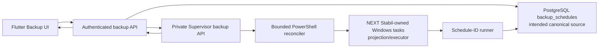
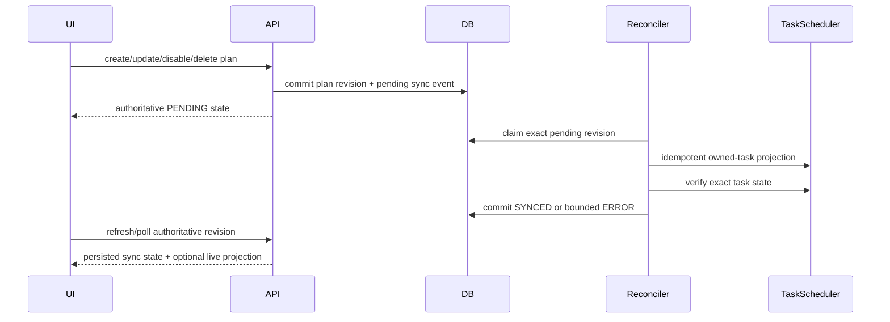

# FOLLOW-UP CHUNK 22 — Backup Planner / retention design gate

Date: 2026-08-24

Source HEAD: `ca27b7d1e4c0a4ac2b41013db1d6ebaa3d36b1ad`

Production DB head at design gate: `followup_contact_person_20260822`

Current production DB head: `followup_backup_planner_retention_20260824`

Current decision: `CHUNK22_FINAL_PHYSICAL_REMOTE_CONTROL_AND_LEGACY_MANAGEMENT_ACCEPTANCE_REQUIRED`

## Safety result

The original audit proved that the requested multi-destination planner,
durable scheduler reconciliation, managed-backup history and auditable
retention could not be implemented safely in the former schema. The owner
subsequently consumed `FOLLOWUP_BACKUP_PLANNER_SCHEMA_MIGRATION_APPROVAL_REQUIRED`
for the exact additive design. The implementation and production migration are
now complete; the original design and gate evidence below are retained.

The migration must be additive. Existing schedule rows, backup/restore runs and
`NEXT_STABIL_BACKUP_V1` manifests remain valid. There is no historical rewrite
or automatic catalog adoption in this design.

## Current architecture and source of truth

Current ownership is sound at the task boundary: a schedule maps to the stable
task name `NEXT Stabil - Backup - <schedule_id>` and the task action contains
only that ID. The reconciler recognizes only tasks carrying the
`NEXT_STABIL_MANAGED_BACKUP_V1` marker. Windows Task Scheduler is a projection,
not the business source of truth.

The cross-system transaction is not durable, however:

1. create/update/delete changes the SQLAlchemy session;
2. the API calls Supervisor reconciliation before `db.commit()`;
3. Windows Task Scheduler can therefore change while the database transaction
   is still uncommitted;
4. a later database rollback can leave the task projection ahead of or behind
   canonical state;
5. a newly created task can run before its schedule row is visible to a second
   database transaction;
6. a delete can remove the task before a failed database transaction restores
   the row.

`schedule_views()` also turns any Supervisor preview exception into
`sync_failed` for every schedule and keeps no durable revision, last successful
sync, bounded error code or retry intent. The Flutter client waits for the API
call and invalidates the list provider, but has no durable pending revision to
poll; this explains intermittent slow/stale synchronization without requiring
duplicate task ownership.

Read-only production inventory at the design gate:

- four database schedules exist: three enabled and one disabled;
- three corresponding owned Windows tasks exist, are Ready, and have last
  result `0`; the disabled schedule correctly has no task;
- seven historical backup runs exist and none is active;
- the observed state is synchronized now, but the transaction failure windows
  above remain deterministic in source;
- the current scheduler unit suite passes, proving task-level idempotency but
  not database/task atomicity.

## Why persistence cannot be reused safely

`backup_schedules` currently stores name, enabled flag, scope, destination,
cadence/timezone and next run only. It cannot persist:

- destination type/identity/availability and measured capacity;
- independent retention policy or the default-off automatic deletion choice;
- percentage/absolute reserve, minimum keep or protected backups;
- reconciliation revision, durable pending/error state or retry intent;
- soft deletion needed to reconcile task removal after commit;
- positive ownership of managed backup objects;
- filesystem deletion state or an auditable deletion result.

`backup_runs` records executions but is not a trustworthy managed-file catalog:
failed/partial runs may exist, destination changes lose plan-root context, and
older manifests were not created with planner ownership. Encoding these fields
inside names, paths, Task Scheduler XML or an untracked sidecar would create a
second source of truth and would not support transactional audit. A schema
migration is therefore genuinely required.

## Proposed additive migration

Proposed revision:
`followup_backup_planner_retention_20260824`, parent
`followup_contact_person_20260822`.

### Extend `backup_schedules` (the existing table becomes the plan table)

Keep the table and IDs for API/history compatibility. Add:

- `destination_type`: `local_path`, `removable_or_mounted_path`, or
  `network_path`;
- `destination_identity`, `destination_filesystem`,
  `destination_last_seen_at`, `destination_total_bytes`,
  `destination_free_bytes` (metadata only; never credentials);
- `destination_status`: `unknown`, `available`, or `unavailable`;
- `auto_delete` default `false`;
- `minimum_free_percent` and `minimum_free_bytes`;
- `minimum_backups_to_keep`, conservative default `3`;
- optional `keep_last_n`, `keep_days`, `preserve_weekly_count`, and
  `preserve_monthly_count`;
- `retention_trigger`: `after_successful_backup`, `daily`, or `custom_schedule`,
  plus nullable custom timing fields;
- `plan_revision` default `1`, `last_reconciled_revision` default `0`;
- `sync_status`: `pending`, `synced`, `error`, `disabled`, or
  `destination_unavailable`;
- `last_sync_at`, `last_sync_error_code`, and `last_destination_check_at`;
- `deleted_at` for a plan tombstone while owned-task removal is reconciled.

Numeric fields receive nonnegative/range checks. Existing rows receive only
safe structural defaults: automatic deletion remains off, no existing backup
is deleted or adopted, and no destination identity/type is inferred beyond a
generic filesystem-path classification that the operator can later confirm.

### Add `backup_plan_sync_events`

This is a transactional outbox and audit stream:

- plan ID and plan revision;
- requested operation (`upsert` or `remove`);
- status (`pending`, `running`, `succeeded`, `failed`);
- bounded error code and timestamps;
- a uniqueness constraint on plan/revision/operation.

The API transaction commits the plan and its event first. Only committed events
may be projected. Reconciliation updates the event and the plan's latest sync
fields in a separate transaction. Retries are revision-aware and idempotent.
Plan deletion is a tombstone until task removal succeeds; backup history is
never cascaded.

### Add `managed_backups`

Positive ownership catalog for retention/deletion:

- stable backup ID, nullable plan ID and unique nullable backup-run ID;
- immutable destination/root/checkpoint/manifest snapshots;
- manifest schema/hash, scope, creation time, app version, source HEAD and DB
  revision;
- artifact count, byte count and integrity state;
- `protected` flag;
- lifecycle (`available`, `deleting`, `deleted`, `missing`, `invalid`) and
  bounded error/timestamps.

Only a manifest-verified catalog entry within its recorded managed root is
eligible for automatic retention. Existing V1 checkpoints remain discoverable,
verifiable and restorable but are not automatically adopted or deletable by the
new retention engine. Any future adoption is an explicit, validated operation.

### Add `backup_deletion_events`

Append-only operational journal:

- backup/plan IDs;
- manual or automatic mode and bounded reason code;
- requesting user for manual actions (nullable for scheduler);
- planned and actually reclaimed bytes;
- status/error and timestamps.

Reclaimed bytes are recorded only after filesystem deletion succeeds. A failed
or interrupted network deletion remains reconcilable and cannot be reported as
successful.

## Transactional reconciliation after migration

The task description should carry a V2 owned marker with plan ID and revision.
No command line contains a destination or secret. A repeated projection of the
same revision is a no-op; an older event cannot overwrite a newer projection.

## Manual backup contract

The current backend request and Flutter button silently default to
`C:\ai-lab-core-backups`. The deployed +29 API consumer must remain compatible,
so the safe source change is additive:

- retain the existing endpoint for supported +29 clients;
- add a versioned manual preflight/start contract that requires an explicit
  destination and never applies a default;
- Windows Flutter uses the existing `file_picker` dependency's native directory
  picker;
- cancel performs no API call and no backup;
- preflight checks normalized destination, write access, availability, free
  space and a conservative size estimate, then returns a short-lived token
  bound to user/scope/path;
- Android/Web state truthfully that host-path selection is Windows-host only;
- a selected path is never silently remembered as the next default.

Path support must be expanded deliberately from drive-letter-only paths to
validated local/mounted paths and UNC paths. Device namespaces, traversal,
unexpected reparse/junction escape, active data roots and unbounded roots remain
rejected. Network credentials remain an OS responsibility and are never stored.

## Retention and deletion safety

Effective reserve is
`max(minimum_free_percent * volume_total, minimum_free_bytes)`.
Automatic deletion is opt-in per plan and defaults off. The deterministic
precedence is:

1. protected/current/restoring/active backup exclusion;
2. exact plan and managed-root ownership;
3. valid manifest and catalog integrity;
4. minimum keep floor;
5. optional count/age/weekly/monthly rules;
6. oldest eligible first for remaining free-space recovery.

Pre-backup dry-run uses conservative projected size; post-success cleanup
re-measures free space. The new backup is excluded from the same pass. If the
reserve cannot be restored without crossing the keep floor, the result is
`RETENTION_BLOCKED_INSUFFICIENT_SPACE`; it never deletes everything or cleans
unmanaged files. An unavailable plan never falls back to another destination.

Deletion requires all of: exact catalog ID, valid manifest, normalized root
match, no reparse escape, matching plan/destination, inactive status, and policy
eligibility. Other plans and all unmanaged files are outside authority. Plan
deletion removes configuration/task projection only and never its backups.
Changing a destination does not move history.

## Required acceptance after approval

The migration implementation must pass isolated upgrade, downgrade and
re-upgrade with no historical backfill, then await a separately explicit
production migration decision if required by the owner. Source acceptance must
include:

- transactional outbox failure/retry and stale-revision tests;
- CRUD/disable/delete/restart projection with no duplicates;
- local, second-root and unavailable/network-like plan fixtures;
- manual picker cancel/preflight/execute with no default;
- retention preview and isolated deletion fixtures;
- minimum keep/protected/current/restore exclusions;
- wrong-root, cross-plan, unmanaged-file, invalid-manifest and reparse escape
  negatives;
- deletion journal recovery and actual-byte accounting;
- full backend/PowerShell/Flutter regression;
- same-device Android System Control recheck from a non-stable signed candidate.

No real production backup deletion is needed for acceptance.

## Gate and roadmap effect

CHUNK22 remains `IN PROGRESS / PHYSICAL SYSTEM CONTROL RECHECK REQUIRED`.
CHUNK23 is BLOCKED / NOT STARTED. Stable remains NEXT Stabil `1.0.2+29`;
Release F is NOT STARTED.

CHUNK24 is not silently marked complete. After the approved CHUNK22 planner and
retention implementation passes, its overlapping retention implementation will
be removed and CHUNK24 will retain broader alert delivery/channel integration
and future policy enhancements only.

## Approved implementation result — 2026-08-24

- Migration `followup_backup_planner_retention_20260824`, parent
  `followup_contact_person_20260822`, passed isolated upgrade, downgrade and
  re-upgrade with both synthetic schedule IDs/data preserved.
- Production migration applied successfully. Four production schedule IDs and
  cadence/destination/enabled semantics were preserved; `auto_delete=false`,
  minimum keep `3`, plan revision `1`, managed catalog `0`, deletion journal
  `0`, and seven historical runs remain unchanged.
- The transactional outbox commits plan/revision before projection. Restart
  reconciliation, failed-event retry, newer-revision supersession and delete
  tombstone retry pass deterministic tests. Three enabled tasks are V2-owned,
  Ready, `domai`/Limited, and unique; the disabled fourth plan has no task.
- Manual V2 uses a Windows native folder picker, has zero API calls on cancel,
  and binds a five-minute HMAC preflight token to user/scope/normalized path.
  Android/Web remain host-only and the deployed legacy endpoint is retained.
- Managed registration requires verified manifest discovery. Retention dry-run
  is oldest-first, respects protected/minimum-count/age/current exclusions and
  reports `RETENTION_BLOCKED_INSUFFICIENT_SPACE` when the reserve cannot be
  restored safely.
- Synthetic file and directory deletion fixtures prove manifest/root/hash,
  unmanaged-file, wrong-root, cross-plan and reparse controls plus actual-byte
  journaling. Existing production files were not deleted or adopted.
- Real managed-backup deletion remains fail-closed because
  `BACKUP_RETENTION_DELETE_ENABLED=false` by default and
  `FOLLOWUP_BACKUP_RETENTION_DELETE_APPROVAL_REQUIRED` is unconsumed.
- Backend/planner/legacy/security/System Control, Node/PowerShell, Flutter
  analyze, focused Backup UI and full Flutter `293/293` gates pass.
- Non-stable signed Android candidate `1.0.2+30` was built from this source for
  the same-device recheck. ADB reported no attached physical device, so CHUNK22
  cannot yet be marked complete.

Required next action: install the +31 non-stable candidate over the currently
installed app without uninstall/data clear and complete the owner physical
remote-control, legacy-adoption preview and checkpoint-loading sequence.

## Explicit legacy V1 adoption implementation — 2026-08-24

The owner expanded CHUNK22 to permit explicit verified import of existing V1
checkpoints. This does not change the default-off retention/delete gate.

- Discovery uses only known backup roots and recognized
  `NEXT_STABIL_BACKUP_V1` manifests; no drive-wide scan exists.
- Inventory checks manifest shape, canonical containment, reparse boundaries,
  required artifacts and declared sizes. The selected checkpoint is then fully
  checksum-verified immediately before adoption.
- The operator adopts exactly one selected verified candidate per confirmed
  request. The token is short-lived and bound to user, checkpoint, root and
  manifest hash. Reuse is duplicate-safe and idempotent.
- `managed_backups.plan_id` may remain null for `UNASSIGNED / LEGACY`; an
  optional plan association is accepted only when the recorded destination is
  the exact verified root.
- Adoption inserts catalog metadata only. It never moves, renames, rewrites or
  deletes checkpoint content. Unverified candidates are visible as such but are
  not adoptable or retention-eligible.
- Production adoption was not exercised: managed backups remain `0`, deletion
  events remain `0`, and existing backup file mutations/deletions remain `0/0`.

Checkpoint inventory was separated from selected-action verification so the UI
does not wait for serial checksums across every historical artifact. A selected
restore or adoption remains fail-closed behind full verification. Flutter now
has distinct loading, empty and error states plus a bounded retry action.

The final non-stable Android candidate is `1.0.2+31` (SHA-256
`0549EA6B6CC472E815C8B7B02CFF4EDB9DF96DE13632717832A460F4D0BF1DFE`).
ADB had no attached device, so physical legacy-preview/adoption and checkpoint
loading acceptance remain pending. Stable remains `1.0.2+29`.

## Cross-platform host selection and asynchronous legacy jobs — 2026-08-24

The +31 physical findings showed that synchronous V1 checksum verification
could occupy an API/database request until SQLAlchemy pool timeout, yielding a
generic adoption error and prolonged UI loading. Initial discovery now reads
only bounded manifest/path/size/catalog metadata; full checksums run as a
Supervisor-owned asynchronous job. The job exposes QUEUED,
VERIFYING_MANIFEST, VERIFYING_FILES, VERIFYING_CHECKSUMS, READY_TO_ADOPT,
ADOPTING, SUCCEEDED, FAILED and CANCELLED states with bounded file/byte
progress. A Supervisor restart produces a retryable interrupted result rather
than a permanent VERIFYING state.

Adoption still rechecks immutable manifest/path/critical-artifact evidence and
remains idempotent. Verification cache keys include the candidate/root and
manifest identity. This execution did not insert a production catalog row,
move or rewrite a checkpoint, or delete a file. The production catalog already
contains 11 rows from the owner's prior +31 attempts; deletion events remain 0
and real deletion stays disabled.

Manual backup V3 is platform-neutral. Its admin-only host selector exposes
opaque registered-location capabilities and capacity/write metadata, resolves
relative directories under the registered root, rejects traversal/device/
active-data/reparse escape cases, and supports host local, mounted and UNC
paths without storing credentials. Windows, Web and Android all preflight the
host destination and receive a path-bound short-lived token; client-device
storage is never used as the backup target.

Read-only production proof classified 27 legacy candidates and verified the
largest 7,986,915,249-byte candidate asynchronously in 34.228 seconds without
blocking the managed endpoint (8.3 ms p95). Cached re-verification took 2.013
seconds. Focused backend/Supervisor tests, isolated adoption and interruption
recovery, Flutter analyze, focused UI tests and full Flutter 296/296 pass.

Final +32 physical Android acceptance remains required; the candidate identity
and hash are recorded in the CHUNK22 operations report. Automatic production
deletion remains disabled and its owner gate is unconsumed.
