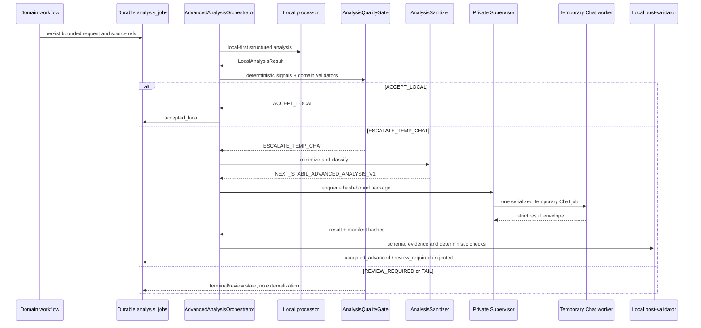

# Global advanced analysis escalation design

Status: **DESIGN READY / RUNTIME NOT IMPLEMENTED**

Owner rule: **LOCAL-FIRST -> TEMPORARY CHAT ONLY WHEN THE LOCAL RESULT IS
INSUFFICIENTLY RELIABLE**.

This document is the architectural contract for a reusable analysis path. It
does not authorize a production migration, a Temporary Chat runtime rollout,
Knowledge Base vector writes, or CHUNK 17 implementation.

## 1. Current-state audit

### Knowledge Base

At the 2026-08-21 design audit, the CHUNK 16 upload was synchronous. `POST /admin/knowledge-base`
reads the full upload, and `KnowledgeBaseService.create()` persists the file
and item, calls `process()` before commit, and only then returns. `process()`
performs native extraction or bounded OCR (`DocumentOCRService`, maximum 250
PDF pages). A long extraction/OCR operation therefore remains inside the HTTP
request and one failure rolls the item and file back together.

Current item processing states are `uploaded`, `extracting`, `ocr`,
`processed`, and `failed`; there is no separate analysis status or durable KB
processing job. Page text, extraction method, OCR confidence, checksum,
metadata, supersession and lexical citations are already persisted. The
pending revision `followup_admin_knowledge_base_20260821` has not been applied
to production and can still be revised additively without a corrective
migration or backfill.

### Local analysis

- The Agent uses local Ollama (`llama3.2`) with JSON-schema output, a bounded
  five-round read-only tool loop and a 12,000-character evidence budget.
- Client reconstruction has a stronger local structured-output pattern: a
  dynamic source-reference allowlist, temperature zero, bounded 4K/8K context,
  token estimation and Pydantic validation.
- Technical AI retrieves deterministic evidence, marks retrieved material as
  untrusted data, separates facts/inferences/missing information, and augments
  it with validated Vision observations. It does not have a common quality
  gate or a generic escalation path.
- OCR supplies page-level confidence; extraction explicitly distinguishes
  native extraction from `requires_ocr`. These are reusable quality signals.

### Vision and Temporary Chat

The current path is:

`backend -> private Supervisor 127.0.0.1:8787 -> VisionQueue -> Playwright ->
dedicated Edge profile -> mandatory Temporary Chat`.

Reusable, already-proven properties:

- private derived-HMAC bridge and no public `/control` route;
- canonical-path and checksum validation under a bounded spool;
- one visible Temporary Chat job at a time;
- persistent job/status files, restart recovery, cancellation and 72-hour
  terminal spool retention;
- `AUTH_REQUIRED` and `UI_CHANGED` pause states;
- maximum three worker attempts and one format-only response retry;
- mandatory Temporary Chat verification and explicit rejection of normal chat;
- marker envelope, strict JSON schema, job ID and source-ref validation;
- result/output hashes and no content in normal operational logs.

Vision-specific elements that remain specialized:

- image selection/classification and conversion (maximum four staged sources
  at the Supervisor boundary, 15 MiB each, prepared image edge 2048 px);
- `NEXT_STABIL_VISION_JOB_V1` and `NEXT_STABIL_VISION_V1` schemas;
- visible-scale measurement rules, image-quality coverage and storage on
  Document pages/assets;
- the existing `/vision/*` routes and deployed-client compatibility.

Current limitations:

- `VisionQueue` and its manifest fields are Document/Vision-specific;
- the browser queue is not shared with other Temporary Chat job types;
- Supervisor persistence is file-based, while the backend persists only
  domain Vision state on Documents/pages/assets;
- an explicit Vision request uses FastAPI `BackgroundTasks`; the dispatcher
  makes pending Document state recoverable, but there is no generic durable
  analysis-job ledger.

## 2. Target architecture

The repository-consistent component name is `AdvancedAnalysisOrchestrator`.
It is a domain-neutral application service, not a Knowledge Base or Vision
service.

Responsibilities:

1. accept a bounded `AnalysisRequest`;
2. select an allowlisted local processor by `analysis_type`;
3. persist and execute the local attempt;
4. evaluate a shared deterministic quality gate;
5. accept locally, escalate, require review, or fail;
6. sanitize and hash the minimum external package;
7. enqueue a Temporary Chat job through the private bridge;
8. validate the strict returned structure;
9. execute deterministic/domain post-validation;
10. expose one canonical result with evidence and provenance.

Temporary Chat never receives a DB session, write tool, CRM command, Qdrant
client, arbitrary URL, or filesystem path. Its output cannot directly modify
business rows, vectors, documents, or customer entities.

## 3. Global contracts

### 3.1 AnalysisRequest

`AnalysisRequest` is a strict, versioned internal model with unknown fields
rejected:

- `schema_version`;
- `analysis_id` (UUID);
- `analysis_type`: `technical_interpretation`, `formula_calculation`,
  `table_analysis`, `standards_comparison`, `consistency_check`,
  `document_interpretation`, or `visual_analysis`;
- `source_domain`: `knowledge_base`, `customer_document`, `technical`,
  `calculation`, `vision`, or a future allowlisted domain;
- `source_refs`: opaque internal source descriptors with stable checksums;
- `problem_statement`;
- bounded `structured_inputs`, `units`, `formulas`, `constraints`, and
  evidence descriptors;
- allowlisted `allowed_methods` (never commands/tools supplied by a user);
- `sensitivity`;
- declared context/source limits and actor/request provenance.

The source descriptors remain local. Only sanitized `S1...Sn` aliases can
cross the Temporary Chat boundary.

### 3.2 LocalAnalysisResult

The local processor returns strict structured data:

- `analysis_id`, `processor_id`, `processor_version`, model identity when used;
- `result`;
- `evidence_refs` and per-claim coverage;
- `unresolved_questions` and `assumptions`;
- detected constraints, variables and normalized units;
- `verification_possible`;
- deterministic check results;
- extraction/OCR/parse signals;
- truncation, timeout, invalid-output and unsupported-operation codes;
- model uncertainty as one signal, never the sole confidence value.

`confidence` is a computed classification (`high`, `medium`, `low`,
`indeterminate`) accompanied by its signal vector. Free-form model confidence
cannot raise the classification.

### 3.3 Sanitized Temporary Chat package

Schema: `NEXT_STABIL_ADVANCED_ANALYSIS_V1`.

Allowed fields:

- `schema_version`, `analysis_id`, `problem_type`;
- opaque `source_refs`;
- technical excerpts explicitly marked as untrusted data;
- formulas, variables, values, units and constraints;
- bounded table data;
- requested output and validation requirements.

Initial hard bounds for the generic text/data path:

- serialized package: 64 KiB UTF-8;
- sources: 8;
- excerpts: 24, maximum 2,000 characters each and 48,000 characters total;
- formulas: 32; variables: 128; constraints: 64;
- tables: 4, maximum 2,000 cells combined;
- no binary attachments in the generic contract.

Vision retains its stricter image contract and four-source/15-MiB boundary.
If a request exceeds a bound, it is reduced locally with explicit evidence
coverage loss or becomes `REVIEW_REQUIRED`; it is never silently truncated.

### 3.4 Temporary Chat result

Schema: `NEXT_STABIL_ADVANCED_ANALYSIS_RESULT_V1`, inside
`NEXT_STABIL_JSON_BEGIN` / `NEXT_STABIL_JSON_END`. Unknown top-level fields are
rejected. Required fields:

- `schema_version`, `analysis_id`;
- bounded `result`;
- `calculation_steps` or `verification_steps` where appropriate (auditable
  operations, not a request for hidden chain-of-thought);
- `formula_used`, normalized units and values;
- assumptions and constraints checked;
- source refs;
- uncertainties;
- result classification and verification recommendation.

Every source ref must be in the submitted allowlist. The response maximum is
100,000 characters, matching the established Vision envelope bound.

## 4. Deterministic quality gate

`AnalysisQualityGate` evaluates rules configured and versioned per
`analysis_type`. A numeric score may assist reporting, but hard rules take
precedence.

Signals include:

- extraction and OCR confidence/coverage;
- missing or uncited evidence;
- unresolved variables and unit ambiguity;
- conflicting independent local passes;
- deterministic validation failures or impossible value ranges;
- unsupported formula/operation;
- incomplete evidence or context-bound exceedance;
- local timeout/unavailability;
- malformed structured output;
- model uncertainty combined with objective signals;
- domain validators (formula dimensionality, table shape, standard version,
  source-date/status consistency).

Decisions:

- `ACCEPT_LOCAL`: structured output valid, mandatory deterministic checks pass,
  required evidence is covered, and no hard ambiguity remains.
- `ESCALATE_TEMP_CHAT`: local output is incomplete/unreliable for a reason the
  advanced route can address, the data is externally eligible, and the attempt
  budget remains.
- `REVIEW_REQUIRED`: restricted or non-sanitizable input, safety-critical
  ambiguity, unresolved contradiction, or advanced output that cannot be
  deterministically validated.
- `FAIL`: invalid request/source, permanent processor failure, or no safe route
  to a result.

Maximum browser analysis attempts are two: one reasoning attempt and at most
one format-only repair that must preserve meaning. A reasoning retry requires
an explicit operator/domain retry and creates a new bounded attempt; it never
loops automatically. One active job per input fingerprint is allowed.

## 5. Privacy and sanitization

`AnalysisSanitizer` is global and fail-closed. Sensitivity classes:

- `public_reference`: public technical source; minimum content may be sent;
- `internal_non_sensitive`: non-customer operational/technical content after
  secret and internal-ID screening;
- `customer_sanitizable`: only after deterministic PII removal and a clean
  post-sanitization scan;
- `restricted_never_external`: never sent to Temporary Chat.

The sanitizer removes or rejects unnecessary names, company/person identity,
addresses and precise location, phone/email, CRM/database IDs, free-form
customer notes, credentials, tokens, cookies, secrets and unrelated metadata.
Internal references become `S1...S8`. Mapping to canonical evidence stays
local in `analysis_job_sources`.

For `customer_sanitizable`, both a field-aware transformation and a second
pattern/entity scan must pass. A detected secret, uncertain identity removal,
or required restricted field produces `REVIEW_REQUIRED` with
`sanitization_not_proven`; there is no best-effort externalization.

The sanitized package itself is schema-validated, canonically serialized and
hashed before staging. Uploaded/source text is surrounded by untrusted-data
markers and is never treated as an instruction. The system prompt owns the
instruction hierarchy.

## 6. Post-Temporary-Chat validation

The local validator requires:

1. envelope and strict schema validity;
2. exact `analysis_id` and package hash association;
3. source refs contained in the submitted allowlist;
4. known/convertible units and finite values;
5. configured value bounds and constraints;
6. deterministic recalculation where possible;
7. evidence coverage for material claims;
8. contradiction comparison with source facts and local result;
9. no command, URL, identity or new source injected by the result.

Final states are `accepted_advanced`, `review_required`, or `rejected`.
Temporary Chat output is derived evidence, never canonical truth before this
stage.

## 7. Supervisor and worker evolution

Choose approach **B**: preserve `/vision/*` and factor shared internals before
adding private `/analysis/*` endpoints.

Proposed private endpoints:

- `GET /analysis/health`;
- `POST /analysis/jobs`;
- `GET /analysis/jobs/{job_id}`;
- `POST /analysis/jobs/{job_id}/cancel`;
- `POST /analysis/resume`.

The generic request carries only an analysis ID, type, fingerprint, package
SHA-256 and an allowlisted relative spool path. It never carries arbitrary
commands, URLs or absolute paths. Use a separately derived HMAC purpose
(`next-stabil-analysis-supervisor-v1`) while retaining the existing Vision key
and routes unchanged.

Refactor `VisionQueue` internals into a global `TemporaryChatQueue` arbiter
with typed adapters. Vision keeps its manifest/worker and compatibility API;
advanced analysis gets its own schemas and worker prompt. The arbiter permits
exactly one active browser job globally across both adapters. Each job opens a
new mandatory Temporary Chat in the dedicated Edge profile. No normal-chat
fallback is permitted.

Use separate bounded spool namespaces:

- existing `data/vision-spool` during compatibility migration;
- new `data/analysis-spool` for sanitized generic packages.

Shared primitives are canonical path/hash checks, atomic status writes,
serialized scheduling, restart recovery, pause/resume, cancellation, retry,
TTL and safe logging. Job-type schemas, prompts and result validators stay
separate. Migration to a common physical spool is unnecessary and risky.

## 8. Durable job persistence and idempotency

The database is canonical for domain workflow state; Supervisor files are the
host execution record. A generic `analysis_jobs` model is preferable to
separate KB/customer/calculation escalation tables.

Recommended `analysis_jobs` fields:

- UUID `id`, `analysis_type`, `source_domain`, `sensitivity`;
- `input_fingerprint`, request/schema version and quality-policy version;
- state: `queued`, `running`, `awaiting_auth`, `awaiting_ui_fix`, `validating`,
  `complete`, `failed`, `cancelled`, `review_required`;
- decision and final classification;
- local processor/model identity, bounded quality signals and limitation codes;
- sanitized package hash/size (not raw customer package in logs);
- Supervisor job ID, reasoning-attempt count, format-retry count;
- safe error code, retry time, started/finished timestamps and actor/domain
  provenance.

`analysis_job_sources` maps `S1...Sn` to local domain/entity/page/chunk IDs,
checksums and sensitivity. The mapping never leaves the backend.

A partial unique index on `(analysis_type, source_domain, input_fingerprint)`
for active states prevents duplicate simultaneous work. The fingerprint covers
canonical structured input, source checksums, processor/policy versions and
requested output. Retry is exact-job/single-domain-object only. No automatic
historical scan is introduced.

KB extraction needs a distinct durable `knowledge_base_processing_jobs` table
because extraction/OCR is not necessarily analysis. It stores item ID, input
checksum/fingerprint, current stage, attempts, retry time, safe error code and
timestamps, with one active job per item/checksum. Conflating it with
`analysis_jobs` would obscure whether extraction or reasoning failed.

## 9. Knowledge Base pipeline

Final automatic flow:

1. Admin upload validates metadata/file and checksum.
2. One transaction persists the item, source file identity and a queued KB
   processing job; the API returns immediately (`201` with queued state).
3. A durable dispatcher claims the exact job.
4. Native extraction runs; OCR runs only if required.
5. Pages and raw evidence are persisted atomically for the attempt.
6. A domain classifier decides whether semantic/technical analysis is needed.
7. `AdvancedAnalysisOrchestrator` runs locally.
8. The quality gate accepts locally or submits a sanitized Temporary Chat job.
9. Local post-validation persists derived structured knowledge with
   provenance, or marks review/failure.
10. Source page chunks are built.
11. After the existing vector-write gate is separately granted, embeddings are
    written to the KB-only collection.
12. Retrieval/index verification makes the item ready.

No separate normal-flow Analyze button is required. Admin retry remains one
item/one failed job and is audited.

### Status separation

`processing_status` describes source preparation only:

`uploaded -> queued -> extracting -> ocr -> processed | failed`.

`analysis_status` describes reasoning:

`not_required`, `local_pending`, `local_processing`, `local_accepted`,
`advanced_required`, `advanced_queued`, `advanced_processing`,
`advanced_validating`, `advanced_accepted`, `review_required`, `failed`.

Vector/index readiness should remain a separate `indexing_status` if exposed:
`not_requested`, `pending`, `indexing`, `ready`, `failed`, `blocked_by_gate`.
This prevents the UI from reporting an extracted item as fully searchable.

### Structured knowledge

Derived structures are optional, typed and source-backed: definitions,
formulas, variables, units, constraints, values/ranges, tables,
standards/references, applicability, exceptions, worked calculations and
uncertainties. Every entry carries page/source refs, extraction/analysis method,
job ID, schema version and verification state. Raw page evidence remains
canonical; a derived structure never overwrites it.

## 10. Pending migration recommendation

Because `followup_admin_knowledge_base_20260821` has not reached production and
has zero backfill, revise that pending revision before its next isolated
round-trip rather than immediately stacking a corrective revision.

Recommended additive changes:

- align the pending `knowledge_base_items.source` column with the already
  implemented 500-character API/model contract (the current pending migration
  still declares 255);
- add `queued` to the KB processing-state check;
- add `analysis_status` and `indexing_status` to `knowledge_base_items`;
- create `knowledge_base_processing_jobs`;
- create global `analysis_jobs` and `analysis_job_sources`;
- create `knowledge_base_analysis_artifacts` containing bounded validated JSON,
  schema/job provenance and original page refs;
- add indexes/constraints for one active KB processing job and one active
  analysis fingerprint;
- keep production backfill at zero and defaults safe for new rows only.

Do not store Temporary Chat full responses, customer text, secrets or cookies
in job logs. The validated bounded result may be retained as derived domain
data; raw worker output remains short-lived in the protected spool.

The revision must again pass isolated upgrade, downgrade and re-upgrade before
any production migration approval is requested.

## 11. Qdrant and retrieval

The existing separate collection design remains correct:

- collection `ai_lab_knowledge_base_chunks`;
- model `qwen3-embedding:0.6b`;
- 1024 dimensions, Cosine;
- explicit `source_type=knowledge_base` and deterministic item ownership.

Add `content_kind=source` to original page chunks. Initial CHUNK 16 indexing
should embed only original/source-derived chunks whose excerpts resolve to a
page citation. Keep advanced structured output relational for the first
release. It may later be embedded as `content_kind=derived` only after a
retrieval evaluation, with `derived_from_page_ids` and original-page citations;
it must never replace or outrank uncited source evidence by default.

Recommended sequence is **C — generic orchestration primitives first**:

1. approve this design;
2. revise the pending migration and implement durable async KB processing plus
   global contracts/local quality gate;
3. implement the shared Supervisor adapter and sanitized Temporary Chat path
   behind a runtime gate;
4. pass isolated privacy, persistence and Vision regressions;
5. consume the existing KB vector-write gate only in a separate approved
   execution, create/index the KB collection, then complete CHUNK 16.

Production vector writes remain zero in this design execution, and
`ai_lab_document_chunks` is untouched.

## 12. Global application

- **Knowledge Base:** extract locally, analyze locally, escalate only an
  eligible sanitized technical package, validate, then index original evidence.
- **Technical analysis:** deterministic retrieval and local model first;
  advanced route only for unresolved interpretation, with citations preserved.
- **Customer calculation:** extract required case values locally, replace
  identity with opaque refs, combine with KB formula/rules, escalate only the
  dry calculation, then recalculate locally.
- **Document analysis:** parser/OCR/local model first; only minimal sanitized
  excerpts can cross the boundary.
- **Vision:** keep the specialized image contract and API, but align its final
  outcome with common accept/review/fail semantics and share the global browser
  arbiter.

Knowledge Base general reference and customer-specific facts remain distinct.
The orchestrator cannot make a general reference override a customer fact.

## 13. Failure and retry model

| Condition | State/action |
|---|---|
| Local processor unavailable/timeout | escalate only if eligible; otherwise `failed` or `review_required` |
| Local malformed JSON | one local format repair; then quality gate |
| Low confidence/conflicting passes | escalate if sanitizable; otherwise review |
| Sanitization failure/restricted data | `review_required`, never externalize |
| Supervisor unavailable | retain `advanced_queued`, bounded retry |
| `AUTH_REQUIRED` | `awaiting_auth`, globally pause browser queue |
| `UI_CHANGED` | `awaiting_ui_fix`, globally pause; no selector guessing |
| Temporary Chat malformed envelope | one format-only retry |
| Timeout/worker failure | bounded attempt; no normal-chat fallback |
| Unknown source ref | reject result |
| Post-validation mismatch | `review_required` or `rejected`, no write-through |
| Cancellation | cancel exact job; preserve source/item and audit |

Status transitions are persisted before side effects. Backend and Supervisor
restart reconcile by analysis ID, Supervisor job ID and fingerprint. A terminal
job is never auto-reopened, and escalation cannot recursively create another
escalation.

## 14. Observability and threat boundaries

Safe operational logs contain only job ID, analysis type, sanitized package
hash/size, state transitions, timings, processor/model identity, bounded error
code and source-ref count. They exclude customer PII, source/full response
text, images, cookies, tokens and credentials.

Threat controls:

- source material is data, not instruction;
- prompts have a fixed instruction hierarchy and allowlisted output goal;
- strict sanitization and sensitivity policy precede spooling;
- canonical path and hash checks protect the spool;
- source refs and result fields are allowlisted;
- no arbitrary URL, command, tool or dynamic script is accepted;
- Temporary Chat is mandatory, with no normal-history fallback;
- external results are locally validated and cannot directly write canonical
  state.

## 15. Test plan for runtime implementation

### Unit

- easy local result stays local;
- hard/insufficient result escalates;
- false escalation is bounded;
- per-type gate thresholds and hard-rule precedence;
- PII removal and clean rescan;
- `restricted_never_external` fail-closed;
- package size/source/page/table bounds;
- strict request/result schemas and unknown source refs;
- unit/formula/value validators and conflicting local passes;
- fingerprint/idempotency and attempt budgets.

### Backend/integration

- KB upload returns with `queued` before extraction/analysis completes;
- restart preserves queued/running work and exact retry;
- local acceptance creates no Supervisor job;
- sanitized escalation success and post-validation acceptance;
- invalid result, timeout, `AUTH_REQUIRED`, `UI_CHANGED`, cancel and review;
- backend/Supervisor reconciliation without duplicate work;
- no customer fields in package/spool/logs;
- no direct business/Qdrant mutation from advanced output.

### Supervisor/worker

- legacy `/vision/*` contract regression;
- `/analysis/*` HMAC, path/hash/size rejection and cancellation;
- Vision and analysis jobs share one global browser slot;
- mandatory Temporary Chat and normal-chat rejection;
- marker, format retry, source-ref and result hash validation;
- restart recovery and bounded TTL.

### Knowledge Base/vector

- native, OCR, local-accepted, advanced-accepted and review-required fixtures;
- structured formula/table provenance;
- original-page citation preference;
- isolated KB collection source/derived isolation and idempotent ownership;
- production customer collection untouched.

## 16. Roadmap replacement for CHUNK 17

Replace **LOCAL ANDROID AI / CALCULATION ENGINE R&D** with:

**FOLLOW-UP CHUNK 17 — GLOBAL ADVANCED ANALYSIS BRIDGE / TEMPORARY CHAT
ESCALATION**.

Retain the valuable requirements from the former item: dry problems,
formula/variable/unit normalization, PII removal, independent checks and
deterministic comparison. Android AI is no longer the primary route; a local
processor may be added later only as one interchangeable local-first adapter.

CHUNK 17 runtime implementation is not started by this design.

## 17. Gates

- Existing, unconsumed: `FOLLOWUP_KNOWLEDGE_BASE_VECTOR_WRITE_APPROVAL_REQUIRED`.
- Required before runtime bridge implementation:
  `FOLLOWUP_GLOBAL_ADVANCED_ANALYSIS_RUNTIME_APPROVAL_REQUIRED`.
- Required before applying the revised pending production schema:
  `FOLLOWUP_ADMIN_KNOWLEDGE_BASE_MIGRATION_APPROVAL_REQUIRED`.
- Existing Vision and public/private network boundaries remain unchanged.

## 18. Runtime implementation checkpoint — 2026-08-22

The owner consumed `FOLLOWUP_GLOBAL_ADVANCED_ANALYSIS_RUNTIME_APPROVAL_REQUIRED`
for the bounded source implementation. Strict versioned request/local/package/
result contracts, deterministic quality decisions, one sanitizer, local
post-validation, durable generic jobs, KB processing jobs and derived artifacts
are implemented. KB upload is persist/enqueue/return, with extraction and
analysis performed by a recoverable dispatcher. Private purpose-separated
`/analysis/*` uses the existing Temporary Chat browser primitives and shares one
global lease with Vision; `/vision/*` remains compatible.

Runtime enablement and KB vector writes default to false. The revised pending
migration passes isolated up/down/up with zero backfill. Source-only KB vector
indexing passes against an isolated Qdrant 1.18.3 target. A public-safe browser
smoke failed closed at `AUTH_REQUIRED` before submission; durable pause/restart,
result binding and accepted/review/rejected behavior are covered synthetically.
No production migration, KB collection/write, customer Temporary Chat/Vision
job, CHUNK 17 rollout or release occurred.

Remaining ordered gates:

1. `FOLLOWUP_ADMIN_KNOWLEDGE_BASE_MIGRATION_APPROVAL_REQUIRED`;
2. `FOLLOWUP_KNOWLEDGE_BASE_VECTOR_WRITE_APPROVAL_REQUIRED`.
